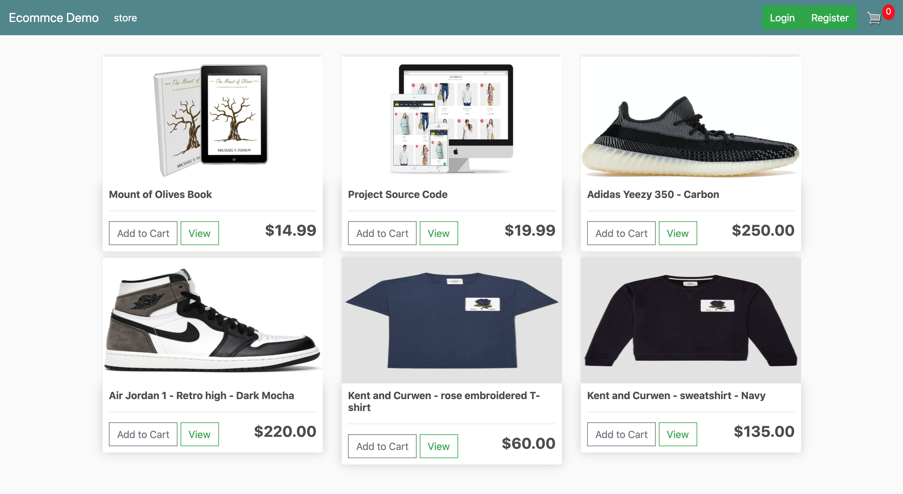
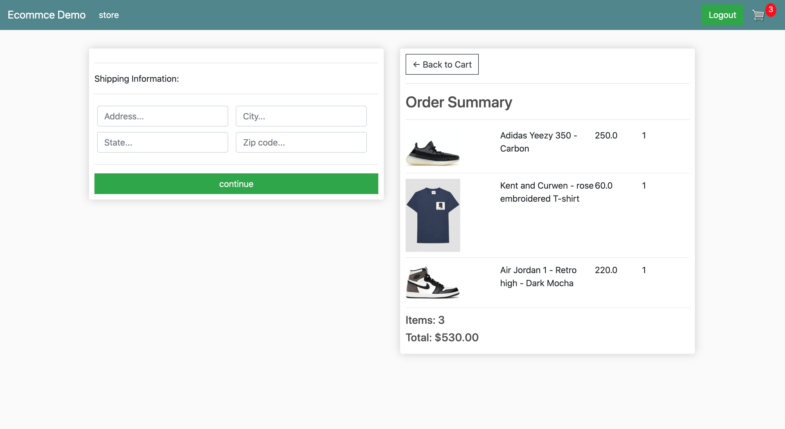
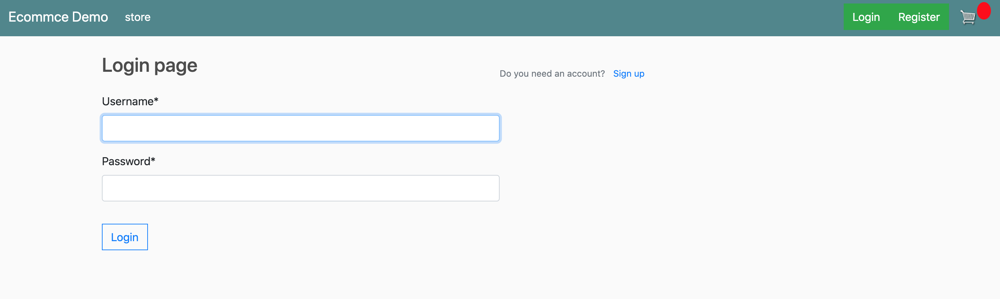
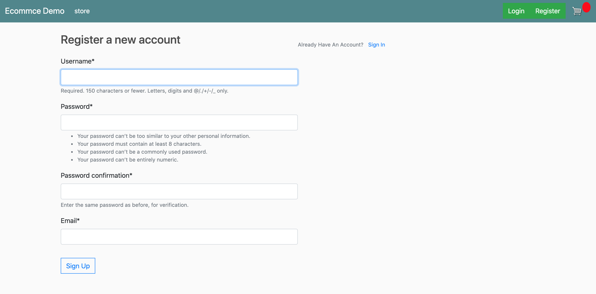
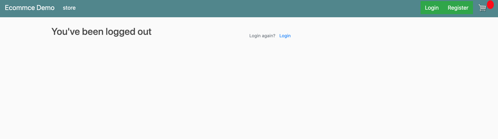

# ecommerce_website
A E-commerce website allow seller to host their products, get order and shipping informations. \
• Developed backend application in Python Django. \
• If user is authenticated, we can get order informations from database. Otherwise, we get order from browser cookies. \
• Buyer can modify products amount in checkout page using up and down arrow in the real time. \
• Offer secured paying method though the Paypal API.

## Demo
Home Page

Cart Page

Checkout Page

Paypal API

Login Page, Register Page,Logout Page

