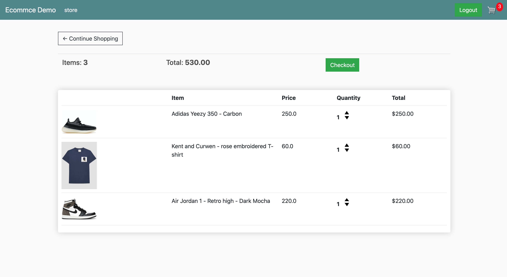

# ecommerce_website
A E-commerce website allow seller to host their products, get order and shipping informations. \
• Developed backend application in Python Django. \
• If user is authenticated, we can get order informations from database. Otherwise, we get order from browser cookies. \
• Buyer can modify products amount in checkout page using up and down arrow in the real time. \
• Offer secured paying method though the Paypal API.

## Setup

1. Git Clone the project with: ```git clone https://github.com/hongfu12321/ecommerce_website```.
2. Move to the base directory: ```cd ecommerce_website```
3. Create a new python enveronment with: ```python -m venv env```.
4. Activate enveronment: ```env\Scripts\activate``` on windows, or ```source env/bin/activate``` on Mac and Linux.
5. Install required dependences with: ```pip install -r requirements.txt```.
6. Make migrations with: ```python manage.py makemigrations``` and then ```python manage.py migrate```.
7. Run app localy with: ```python manage.py runserver```.

## Demo
Home Page


Cart Page


Checkout Page


Paypal API


Login Page, Register Page,Logout Page


